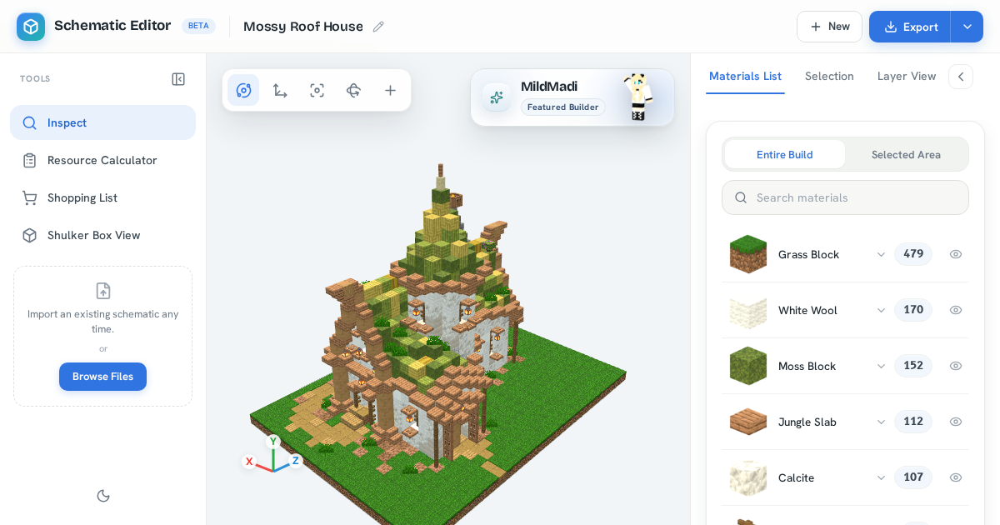

# Schematic Editor

**Live app: <https://actualpugbot.github.io/schematic-editor/>**



A browser-based Minecraft schematic editor. Open on a default featured build, use `New` to start from a blank build platform, or upload a `.litematic`, `.schem`, `.schematic`, or NBT schematic file and inspect or edit it as a 3D Minecraft model with orbit controls, layer-by-layer viewing, and one-click 360 degree rotation.

Schematic Editor runs entirely in the browser — schematic files are parsed locally and never leave your machine.

## Features

- 3D viewer with orbit and spectator cameras, saved camera positions, and auto-rotate.
- Layer-by-layer inspection for following a build floor by floor.
- Block editing on a blank platform or an uploaded build.
- Material list and shulker-box shopping view with crafting recipe breakdowns.
- Export to `.litematic`, `.schem`, or legacy `.schematic`.

## Browser Support

The 3D viewer requires WebGL2, which is available in all current versions of Chrome, Edge, Firefox, and Safari. If the viewer stays blank, make sure hardware acceleration is enabled in your browser settings.

## Run Locally

```bash
pnpm install
pnpm dev
```

The app runs at `http://localhost:5173/` by default.

## Supported Schematic Data

- Sponge `.schem` files with `Palette` and `BlockData` varint arrays.
- Legacy MCEdit `.schematic` files with numeric `Blocks` arrays.
- Litematica `.litematic` files with one or more packed regions.
- Gzip/zlib-compressed or raw NBT payloads.

Files are parsed in the browser; uploads are not sent to a server.

## Export

- Export to `.litematic`, `.schem`, or `.schematic` from the top bar.
- `.litematic` is the default export format.
- Legacy `.schematic` export is limited to block states that exist in the older MCEdit format.

## Deployment

Pushes to `main` publish the app to GitHub Pages with GitHub Actions.

## Minecraft Assets

The app renders blocks using vanilla Minecraft blockstates, models, and textures served from `public/minecraft-assets/`. These assets are © Mojang AB / Microsoft, remain the property of their owners, and are included solely so the app can render Minecraft builds faithfully. They are **not** covered by this project's license and will be removed on request.

The featured default build, *Mossy Roof House*, was created by [MildMadi](https://www.youtube.com/watch?v=KO1yKa34Yl0).

> **Not an official Minecraft product. Not approved by or associated with Mojang or Microsoft.**

## License

The source code of this project is released under the [MIT License](LICENSE). Minecraft game assets and the featured example build are excluded — see the notice in the LICENSE file.
